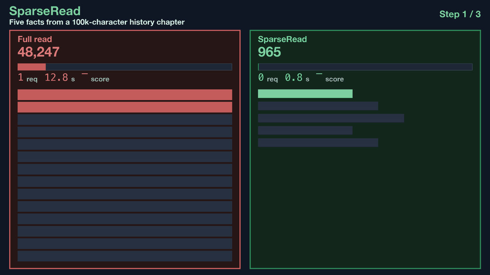

# SparseRead

<div align="center">

**Read less. Solve more.**

SparseRead is a training-free reading layer for tool-using agents. It controls
which evidence enters the model context before an agent pays the cost of a
broad read—while keeping provenance, refinement, verification, and native
fallbacks explicit.

[](https://github.com/Zedong-Liu/SparseReading/actions/workflows/ci.yml)
[](LICENSE)
[Paper](https://arxiv.org/abs/2608.22237) · [Site](https://zedong-liu.github.io/SparseReading/) · [中文](README.zh-CN.md)

</div>

## 🔥 News

- **2026-09-28:** [v0.1.3](https://github.com/Zedong-Liu/SparseReading/releases/tag/v0.1.3) fixes a large-workspace timeout when switching to full-fidelity native reading in Codex/Pi.
- **2026-09-28:** Added Codex and Pi support in [v0.1.2](https://github.com/Zedong-Liu/SparseReading/releases/tag/v0.1.2).
- **2026-09-14:** Support for Claude Code, OpenCode, OpenClaw, and NanoBot.

<p align="center">
  
</p>

Agents are good at reasoning, but their default reading action is often still:

```text
read everything -> put everything in context -> start reasoning
```

That is expensive for long reports, PDFs, workspaces, logs, spreadsheets, and
multi-file audits. SparseRead adds a small control plane in front of native
agent tools:

```text
artifact -> Read Gate -> Reader Backend -> EvidencePack -> refine / verify / stop
```

The agent still decides what it needs. SparseRead makes the request bounded,
source-anchored, and reversible when native access is the better path.

## Results

The current paper evaluation covers 125 tasks, five workload scenarios, and six
frontier models: Claude Opus 5, Qwen3.6-Plus, DeepSeek-V4-Flash,
DeepSeek-V4-Pro, GLM-5.1, and Kimi-K2.5.

| Headline | Reported result |
|---|---:|
| Maximum token reduction | **92.9%** |
| Maximum wall-time reduction | **89.0%** |
| Model–scenario cells with lower tokens and lower time | **30 / 30** |
| Cells preserving or improving task score | **26 / 30** |
| Sparse-fit cells preserving or improving task score | **22 / 24** |

The gain is not tied to one model: the evaluation includes strong reasoning
models as well as general-purpose frontier models, and the paper reports
benefits for all six models across the full matrix. See the
[paper](https://arxiv.org/abs/2608.22237) for definitions, baselines, and the
complete results.

### Cross-framework results

The paper's end-to-end portability table evaluates the same protocol and
reader backends in three frameworks:

| Framework | Adapter | Median token reduction | Median time saving | Paper status |
|---|---|---:|---:|---|
| [NanoBot](integrations/nanobot/) | `sparseread-nanobot` | **69.0%** | **64.4%** | Evaluated |
| [OpenCode](integrations/opencode/) | `sparseread-opencode` | **71.8%** | **64.9%** | Evaluated |
| [OpenClaw](integrations/openclaw/) | `sparseread-openclaw` | **28.7%** | **28.2%** | Evaluated |
| [Claude Code](integrations/claude/) | `sparseread-claude` | — | — | Supported in this release |
| [Codex](docs/codex-pi-adapters.md) | MCP + plugin hooks/skill | — | — | Source adapter; not paper-benchmarked |
| [Pi](docs/codex-pi-adapters.md) | `@sparseread/pi` extension | — | — | Source adapter; not paper-benchmarked |

Claude Code uses MCP plus `PreToolUse`/`PostToolUse` session hooks rather than
an npm plugin. The local Claude Code validation report is available at
[`benchmarks/qwenclawbench/claude_final_aggregate_20260805.md`](benchmarks/qwenclawbench/claude_final_aggregate_20260805.md);
it is not part of the three-framework table in the paper.

## Install

The current release baseline is a source-install release. It builds a managed
runtime for the selected framework, so the installed integration does not
import from this checkout at runtime.

Requirements: Python 3.11+, [uv](https://docs.astral.sh/uv/), Node.js 22+
for OpenCode/OpenClaw/Codex/Pi, and the target agent CLI.

The installer validates the selected Python before changing a workspace. If the
shell's default Python is too old, use the documented `uv run` form above or
pass `--python /path/to/python3.12`; PDF/XLSX readers are installed by default,
and `--reader-extras none` is available for text-only installations.

```bash
git clone https://github.com/Zedong-Liu/SparseReading.git
cd SparseReading

# Verify the core, adapters, bridge protocol, and release fixture first.
PYTHONPATH="packages/sparseread-core/src:integrations/nanobot/python/src:integrations/opencode/python/src:integrations/openclaw/python/src:integrations/claude/python/src" \
  uv run --project . --extra test pytest tests/test_release_fixtures.py -q
```

Choose one integration:

Codex and Pi use the same core with project-scoped frontend adapters:

Codex and Pi are included in `v0.1.3`. Download the source installer ZIP/tar.gz
from [GitHub Releases](https://github.com/Zedong-Liu/SparseReading/releases/tag/v0.1.3)
and extract it, or clone the repository. Run the commands below from its root.

```bash
uv run --python 3.12 python scripts/install_sparseread.py \
  --platform codex --workspace /absolute/path/to/project --doctor
uv run --python 3.12 python scripts/install_sparseread.py \
  --platform pi --workspace /absolute/path/to/project --doctor
```

Restart in the target project and review the host's trust prompt. Codex hook
trust is separate from installation; Pi project extensions also require review.
If Pi reports an untrusted project, review its files/extensions and explicitly
rerun with `--pi-approve` (trust for that install command only).
Use `--sparseread-mode advisory` for tools/guidance without native-read blocking.
See [design, setup, recovery, and limitations](docs/codex-pi-adapters.md).

```bash
# OpenCode: install into an existing workspace
uv run --project . python scripts/install_sparseread.py \
  --platform opencode \
  --opencode-workspace /path/to/your/project \
  --doctor

# OpenClaw: install into the current OpenClaw profile
uv run --project . python scripts/install_sparseread.py \
  --platform openclaw \
  --doctor

# Claude Code: install MCP and session hooks into a workspace
uv run --project . python scripts/install_sparseread.py \
  --platform claude \
  --claude-workspace /path/to/your/project \
  --doctor
```

For NanoBot, install `sparseread-core` and `sparseread-nanobot` as Python
dependencies; see the [NanoBot adapter guide](integrations/nanobot/python/README.md).
The full installation and platform matrix is in
[`docs/sparseread_installation.md`](docs/sparseread_installation.md) (Chinese)
and the shorter [English installation guide](docs/installation.md).

After installation, users do not need to call `sro_preview` or write a
`HintSpec` by hand. Ask the agent to use SparseRead for a large artifact, for
example:

```text
Use SparseRead to inspect this large report. Extract only the evidence needed
to answer the question, then stop reading once the evidence is sufficient.
```

### Quick test

The repository includes a small long-document fixture:

```bash
opencode run "Use SparseRead to inspect tests/fixtures/quick_test/incident-report.md and report ROOT_CAUSE, MITIGATION_OWNER, and FINAL_DEADLINE."
```

The same request works in an OpenClaw, Claude Code, or NanoBot session after the
corresponding adapter is installed.

## How it works

- **Read Gate** — selects `auto`, `native`, or `advisory` behavior from artifact
  shape and task economics. Low-benefit computation and small-file work stays
  on native tools.
- **Reader Backends** — provide typed, bounded views for text/PDF, structured
  data, and multi-file collections.
- **EvidencePack** — returns compact evidence with source anchors, unresolved
  requirements, and a suggested next action.
- **Stateful protocol** — supports preview, targeted reading, refinement,
  verification, explicit raw fallback, and stopping.

The public production entrypoints are framework-facing tools; users normally
do not need to invoke them directly:

```text
sro_preview(path) -> bounded preview + FileCard
sro_read(target, mode, hint) -> EvidencePack
sro_raw(raw_ref) -> explicit raw fallback
```

## Repository layout

```text
packages/sparseread-core/       framework-neutral core and tests
integrations/<framework>/       NanoBot, OpenCode, OpenClaw, Claude Code adapters
scripts/install_sparseread.py   source installer and doctor
tests/                          release, bridge, gate, and installer tests
benchmarks/                     reproducibility runners and selected fixtures
docs/                           installation, architecture, and design notes
```

The core and adapters are intentionally separate. A framework adapter owns only
the host-specific bridge, lifecycle hooks, and installation surface; it does
not fork the reading protocol.

## Development

Run the core suite independently:

```bash
uv run --project packages/sparseread-core --with pytest --with pytest-asyncio \
  pytest packages/sparseread-core/tests -q
```

Run the full release suite:

```bash
PYTHONPATH="packages/sparseread-core/src:integrations/nanobot/python/src:integrations/opencode/python/src:integrations/openclaw/python/src:integrations/claude/python/src" \
  uv run --project . --extra test pytest -q
```

Build the Python distributions and JavaScript plugins through the same CI path:

```bash
npm --prefix integrations/opencode/plugin ci
npm --prefix integrations/opencode/plugin run build
npm --prefix integrations/openclaw/plugin ci
npm --prefix integrations/openclaw/plugin run build
```

Benchmark runners and historical result files are kept for reproducibility;
they are not imported by any release package. See the
[release architecture](docs/release_architecture.md) before adding a new
integration.

## Release scope and limitations

- The current release is `v0.1.3` and is installable from source bundles.
- PyPI, npm, and official framework-marketplace publishing are not wired yet;
  the source installer is the supported distribution path today.
- Claude Code is supported through MCP and session hooks. Its Windows MCP path
  still needs separate verification in environments where the host CLI or
  permissions differ.
- SparseRead is selective by design. Native access remains the right choice for
  small files, exact full-table computation, and other low-sparsity tasks.

## Contributing

Please read [CONTRIBUTING.md](CONTRIBUTING.md) before opening a pull request.
Bug reports and focused integration feedback are welcome.

## Citation

```bibtex
@article{liu2026readless,
  title   = {Read Less, Solve More: Token-Efficient Sparse Reading for AI Agents},
  author  = {Liu, Zedong and Wu, Jiaan and Ma, Xinyang and Xu, Le and Wang, Kai and Hu, Yuanchao and Tao, Dingwen and Tan, Guangming},
  journal = {arXiv preprint arXiv:2608.22237},
  year    = {2026}
}
```

## License

SparseRead is released under the [MIT License](LICENSE).
